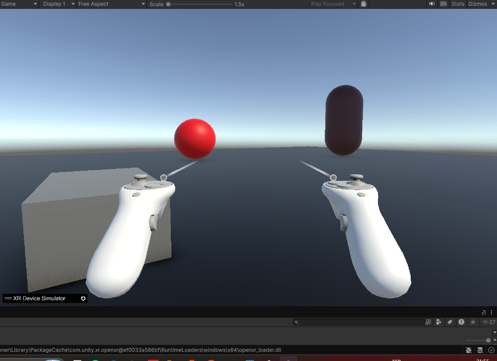
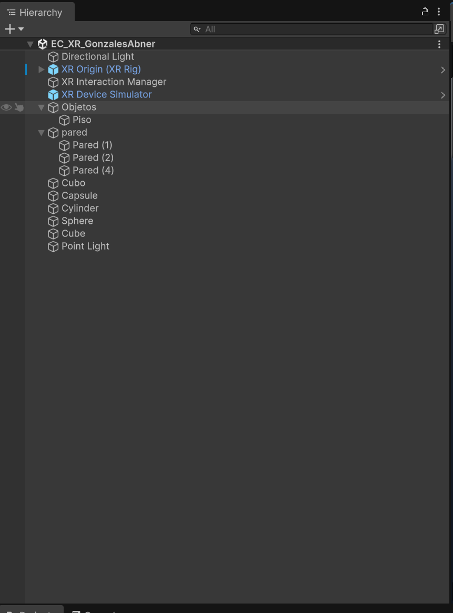

# XR Interaction Challenge

- **Estudiante:** Gonzales, Abner
- **Curso:** Laboratorio de Realidad Extendida (XR) para Videojuegos
- **Docente:** Victor Alejandro Arroyo Castro

## Descripción
Sala de entrenamiento XR desarrollada en Unity 6 con URP y XR Interaction Toolkit. El usuario puede recorrer el escenario, agarrar y lanzar objetos, y activar un botón a distancia mediante rayo.

## Funcionalidades
- Escenario con piso, paredes, iluminación y objetos 3D (cubo, esfera, cilindro, cápsula y botón).
- Cubo y esfera manipulables con Rigidbody y XR Grab Interactable.
- Lanzamiento de objetos (Throw On Detach), como reto libre.
- Botón con XR Simple Interactable: al seleccionarlo con el rayo se oculta la cápsula y al soltar vuelve a aparecer.

## Controles (XR Device Simulator)
- **W, A, S, D + Q, E:** moverse.
- **Clic derecho + mouse:** mirar alrededor.
- **Shift (mantener):** controlar mano izquierda.
- **Espacio (mantener):** controlar mano derecha.
- **G:** agarrar / seleccionar con el rayo.
- **Clic izquierdo:** trigger.

## Capturas

### 1. Vista general del escenario

### 2. Configuración XR en la escena

### 3. Interacción funcionando

## Video demostrativo
[Ver video](https://youtu.be/TU_ENLACE)

## Tecnologías y paquetes
- Unity 6 (6000.0.72f1)
- Universal Render Pipeline (URP)
- XR Interaction Toolkit 3.0.11
- OpenXR Plugin
- XR Plug-in Management
- XR Device Simulator
